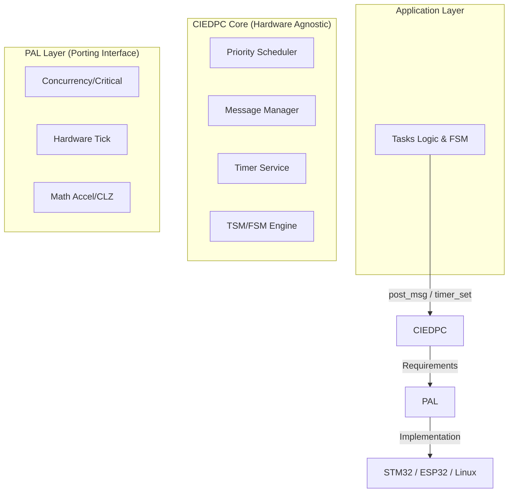

# CIEDPC: Custom Independent Event-Driven Programming Core


**CIEDPC** is an ultra-lightweight, high-performance event-driven programming kernel, inspired by the **Active Object** model with additional custom enhancements. Its core objective is to achieve **"Zero-Touch Porting"**: moving the entire application logic across platforms (for example, from STM32 to Linux simulation) without modifying the core source code.

---

## 🚀 Key Features

- **Strictly Layered Architecture:** Clear separation between App Layer - CIEDPC Core - PAL (Platform Abstraction Layer).
- **O(1) Scheduler:** Priority-based multitasking scheduler using bitmasks for fast event reaction.
- **Static Memory Pools:** Completely eliminates RAM fragmentation and guarantees deterministic behavior for real-time systems.
- **Unified Messaging System:** Automatically adapts pointer size (4-byte on 32-bit, 8-byte on 64-bit), supporting both value transfer and reference transfer (zero-copy).
- **"Shell & Core" Mechanism (TSM & FSM):**
  - **TSM (Table-driven):** Manages high-level operating modes with automatic Entry/Exit actions.
  - **FSM (Pointer-driven):** Handles detailed business logic with high flexibility.
- **Simulation Ready:** Fully supports Linux POSIX simulation to validate logic end-to-end before deploying to hardware.

---

## 🏗 System Architecture



---

## 📂 Directory Structure

```text
CIEDPC/
├── core/                 # Defines and implements the core CIEDPC logic
│   ├── inc/              # ciedpc_msg.h, ciedpc_task.h, ciedpc_timer.h, ciedpc_fsm.h, ciedpc_tsm.h
│   │   └── ciedpc_core.h # Defines core CIEDPC signals, constants, and data structures
│   └── src/              # Implements scheduler, timer engine, and message manager
├── pal/                  # BACKEND (abstraction layer)
│   ├── pal_core.h        # Unified declarations for PAL and system services
│   ├── services/         # Hardware services (hardware mapping)
│   │   ├── timer/        # pal_timer.h contains timer API declarations for per-platform implementation
│   │   └── memrp/        # pal_memrp.c/h contains memory profiling support functions
│   └── arch/             # Implementation (chip/platform-specific source)
│       ├── stm32/        # stm32_arch.c/h contains STM32-specific implementation
│       └── linux/        # linux_arch.c/h contains Linux simulation implementation
├── app/                  # User application logic, including user-defined tasks and FSMs
│   ├── config/           # Application and user configuration
│   ├── task/             # User task and FSM definitions
│   ├── declaration/      # Main implementation of user application behavior
│   └── interface/        # Definition and implementation of external signal interface (task_if)
├── common/               # Shared utilities and data structures used across the project
│   └── container/        # Pure C data structures such as FIFO, Ring Buffer, Linked List
└── test/                 # Integration tests to verify system correctness
    ├── test01/           # Basic tests with ISR tasks and TSM
    ├── test02/           # Tests for features such as message pooling and memrp
    └── test03/           # Integrated complex FSM tests
```

---

## 🛠 Quick Start (Linux Simulation)

CIEDPC supports running simulations directly on Linux to validate logic.

### 1. Requirements

- GCC Compiler
- CMake (version 3.10+)

### 2. Build

```bash
mkdir build && cd build
cmake -DPLATFORM=LINUX ..
make
```

### 3. Run Integration Test

```bash
./ciedpc_test
```

*The result will display TSM/FSM state transitions and Timer Service activity in the terminal.*

---

## 📖 "Shell & Core" Principle

CIEDPC solves complex logic by combining two types of state machines:

1. **TSM (Macro-level):** Manages high-level "modes" (for example: `IDLE`, `RUNNING`, `ERROR`). It automatically cleans up resources when a task changes mode via `on_exit`.
2. **FSM (Micro-level):** Manages detailed "behavior" inside each mode (for example: decoding UART packets byte-by-byte).

This mechanism completely removes tangled flag-based logic and turns the codebase into a clean, diagram-like representation of behavior.

---

## 📝 Documentation

Detailed information about APIs, memory pool planning, and porting to other MCUs can be found in the [User Manual (PDF)](./docs/user-manual.md). Please note that this documentation is presented in Vietnamese to better serve the local developer community, but it can be translated to English in the future if there is demand.

---

## 🤝 Contributing

This project is developed by **Shang Huang (Huynh Thanh Sang)**. Contributions for bug reports or feature proposals are welcome via GitHub Issues.

**License:** MIT.

---

## Future Roadmap

The following roadmap items are planned to further complete and expand CIEDPC:

- Implement PAL services for RAM profiling.
- Implement PAL services for debugging.
- Implement PAL services for tracing and fatal error handling.
- Add processing support for external signal collection interfaces.
- Expand integration tests to further improve system stability.
- Develop more real-world application examples to demonstrate CIEDPC usage in practical scenarios.
- Complete detailed documentation for usage and porting CIEDPC to different platforms.

Please note that these roadmap milestones are not guaranteed and may change depending on development conditions. They will be updated regularly to reflect ongoing progress and planning.
