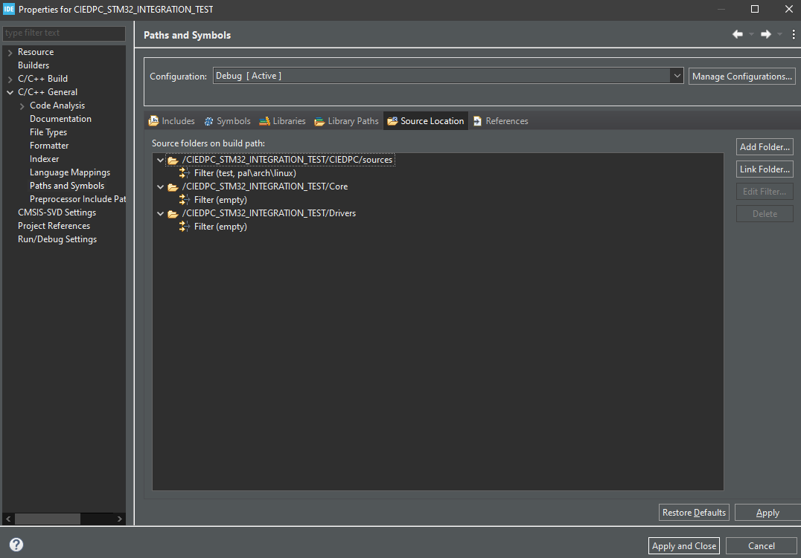

# Tài liệu hướng dẫn sử dụng CIEDPC

Tác giả: Shang Huang - Huỳnh Thanh Sang

Ngày hoàn thiện phiên bản đầu tiên: 2026-05-03

Phiên bản hiện tại: 1.0

## I. Giới thiệu chung

CIEDPC - Custom Independent Event Driven Programming Core là một module lõi được thiết kế để hỗ trợ mô hình lập trình hướng sự kiện (event-driven programming) trên các nền tảng nhúng. Mục tiêu của CIEDPC là cung cấp một giải pháp linh hoạt, dễ sử dụng và có khả năng mở rộng cho việc phát triển ứng dụng nhúng mà không phụ thuộc vào phần cứng cụ thể.

<div style="page-break-after: always"></div>

## II. Cấu trúc thư mục

```text
CIEDPC/
├── core/                        # Định nghĩa và triển khai logic chính của CIEDPC
│   ├── inc/                     # ciedpc_msg.h, ciedpc_task.h, ciedpc_timer.h, ciedpc_fsm.h, ciedpc_tsm.h
│   │   └── ciedpc_core.h        # Định nghĩa các tín hiệu, hằng số và cấu trúc dữ liệu cốt lõi của CIEDPC
│   └── src/                     # Triển khai logic scheduler, timer engine, message manager
├── pal/                         # BACKEND (Lớp trừu tượng)
│   ├── pal_core.h               # Khai báo thống nhất chung cho toàn bộ PAL và các dịch vụ hệ thống
│   ├── services/                # Hardware Services (Mapping phần cứng)
│   │   ├── timer/               # pal_timer.h chứa các khai báo API timer để tự triển khai trên từng nền tảng
│   │   └── memrp/               # pal_memrp.c/h chứa các hàm hỗ trợ memory profiling
│   └── arch/                    # Implementation (Mã nguồn chi tiết từng chip)
│       ├── stm32/               # stm32_arch.c/h chứa các hàm triển khai cho STM32
│       └── linux/               # linux_arch.c/h chứa các hàm triển khai cho môi trường giả lập trên Linux
├── app/                         # Định nghĩa logic ứng dụng, bao gồm các tác vụ và FSM do người dùng tạo ra
│   ├── config/                  # Chứa cấu hình ứng dụng và cấu hình người dùng
│   ├── task/                    # Định nghĩa các tác vụ (tasks) và FSM của người dùng
│   ├── declaration/             # Implementation chính của logic hoạt động của ứng dụng người dùng
│   └── interface/               # Định nghĩa và triển khai cổng giao tiếp với tín hiệu bên ngoài (task_if)
├── common/                      # Các tiện ích và cấu trúc dữ liệu chung được sử dụng trong toàn bộ dự án
│   └── container/               # Các cấu trúc dữ liệu như FIFO, Ring Buffer, Linked List được triển khai thuần C
└── test/                        # BUILD SYSTEM
    ├── test01/                  # Test cơ bản với các tác vụ ISR và TSM 
    ├── test02/                  # Test với các tính năng như message pooling và memrp
    └── test03/                  # Test tích hợp FSM phức tạp
```

<div style="page-break-after: always"></div>

## III. Kiến trúc thiết kế

CIEDPC được chia thành 3 tầng chức năng rõ rệt nhằm đạt mục tiêu "Zero-Touch Porting":

### Application Layer (Tầng Ứng dụng)

Chứa các tác vụ nghiệp vụ do người dùng tự định nghĩa và FSM của ứng dụng. Tầng này chỉ tương tác với Core thông qua bộ API chuẩn như `ciedpc_post_msg()` hoặc `ciedpc_timer_set()`. Tầng này không chứa bất kỳ code nào liên quan đến phần cứng hay thanh ghi vi điều khiển, đảm bảo tính độc lập và dễ dàng di chuyển giữa các nền tảng khác nhau.

Lưu ý: Trong thiết kế testing ở thư mục `test/`, các khai báo về task handler, FSM handler, task table, ... đều nằm gọn trong implementation của từng test case để thực hiện testing một cách độc lập và dễ quản lý. Tuy nhiên, khi sử dụng thực tế trên ứng dụng người dùng, các khai báo này nên được đặt trong thư mục `app/` để tách biệt rõ ràng.

### CIEDPC Core (Tầng Lõi - Bất biến)

Chứa logic thuần túy của mô hình lập trình hướng sự kiện, bao gồm:

- Scheduler: Bộ lập lịch đa nhiệm ưu tiên dựa trên Bitmask (O(1)).
- Message Manager: Quản lý Pool bộ nhớ tĩnh, chống phân mảnh.
- Timer Service: Quản lý danh sách liên kết các bộ định thời phần mềm.
- FSM/TSM Engines: Bộ máy thực thi máy trạng thái.

Trong tầng này, core được thiết kế độc lập hoàn toàn với phần cứng nhằm đảm bảo tính di động và dễ dàng tích hợp vào bất kỳ nền tảng nhúng nào. Core sẽ chỉ tương tác với phần cứng thông qua các hàm trừu tượng được cung cấp bởi tầng PAL.

### PAL - Platform Abstraction Layer (Tầng Trừu tượng)

Tầng này đóng vai trò là cầu nối giữa Core và phần cứng cụ thể. PAL cung cấp các dịch vụ hệ thống như quản lý ngắt, thao tác bit, và các hàm tiện ích khác mà Core yêu cầu để hoạt động. Mỗi nền tảng sẽ có một triển khai riêng của PAL, nhưng tất cả đều tuân thủ cùng một giao diện chung để đảm bảo tính nhất quán.

Trong đó `pal_core.h` chứa các khai báo chung cho toàn bộ PAL, bao gồm các hàm dịch vụ hệ thống như `pal_enter_critical()`, `pal_exit_critical()`, và `pal_get_highest_priority()`. Các dịch vụ này sẽ được triển khai khác nhau tùy theo nền tảng (ví dụ: trên STM32 sẽ sử dụng ngắt để quản lý critical section, trong khi trên Linux sẽ sử dụng mutex). Điều này giúp Core hoàn toàn không phải quan tâm đến chi tiết phần cứng, từ đó đạt được mục tiêu "Zero-Touch Porting".

<div style="page-break-after: always"></div>

## IV. Logic thiết kế chi tiết

### Quản lý bộ nhớ tin nhắn

Hệ thống quản lý bộ nhớ sử dụng bộ nhớ tĩnh để chống phân mảnh. Core sẽ tự động điều phối việc cấp phát bộ nhớ dựa theo kiến trúc sử dụng được trả về trong `sizeof(void*)` của từng message.

Ví dụ:

- Trên kiến trúc Linux 64-bit, `sizeof(void*)` trả về 8.
- Trên kiến trúc STM32 32-bit, `sizeof(void*)` trả về 4.

Dựa theo kiến trúc này, khi người dùng muốn khai báo tùy chỉnh kích thước message pool thì cần đảm bảo kích thước tuân thủ theo quy tắc `sizeof(void*) * 2^n` để đảm bảo hiệu quả trong việc quản lý bộ nhớ và tránh lãng phí không gian lưu trữ. Core sẽ tự động điều phối thông qua cấu hình PAL, giúp tối ưu hóa hiệu suất và sử dụng bộ nhớ một cách hiệu quả.

Trong đó, Core được thiết kế với 4 loại pool sau:

- `BLANK`: Mặc định là 8 đơn vị, mỗi đơn vị có kích thước phụ thuộc vào `sizeof(ciedpc_msg_t)`, dùng để cấp phát các message không có payload, phù hợp cho các tín hiệu đơn giản.
- `ALLOC`: Kích thước mặc định là 16 đơn vị, mỗi đơn vị có kích thước phụ thuộc vào `sizeof(void*) * 2u`, dùng để cấp phát các message có payload, cho phép truyền tham trị và truyền tham chiếu một cách linh hoạt.
- `EXTAL`: Kích thước mặc định là 16 đơn vị, mỗi đơn vị có kích thước phụ thuộc vào `sizeof(void*) * 4u`, dùng để cấp phát các message từ bên ngoài core, cho phép cô lập tài nguyên để Core xử lý trước khi truyền vào hệ thống và các tác vụ được đăng ký để nhận các message này.
- `ISR`: Kích thước mặc định là 16 đơn vị, mỗi đơn vị có kích thước phụ thuộc vào `sizeof(ciedpc_msg_isr_t)`, dùng để ISR truyền tín hiệu vào hệ thống trên FIFO, giúp cô lập tín hiệu từ ISR và đảm bảo an toàn khi truyền vào hệ thống.

### ISR-Safe Injection

Để đảm bảo an toàn khi truyền tín hiệu từ ISR vào hệ thống, CIEDPC bổ sung một FIFO nội bộ bên trong Core để lưu trữ các tín hiệu từ ISR. Khi có ngắt (ví dụ: UART, Timer), PAL sẽ đẩy tín hiệu vào FIFO này. Core sẽ "drain" (rút dữ liệu) từ FIFO này vào các Task Queue ở đầu mỗi chu kỳ Scheduler. Cơ chế này giúp loại bỏ hoàn toàn việc Core phải biết về ISR, đồng thời đảm bảo an toàn và hiệu quả khi truyền tín hiệu từ ISR vào hệ thống.

Nhằm đảm bảo tính an toàn và tránh tranh chấp tài nguyên, việc drain FIFO này được thực hiện trong critical section, đảm bảo rằng quá trình này không bị gián đoạn bởi các tác vụ khác hoặc ISR khác. Điều này giúp duy trì tính nhất quán của dữ liệu và đảm bảo rằng các tín hiệu từ ISR được xử lý một cách an toàn và hiệu quả trong hệ thống CIEDPC.

<div style="page-break-after: always"></div>

### Data-to-Message passing

Dựa theo thiết kế bộ nhớ quản lý tin nhắn, nhằm đảm bảo việc có thể truyền toàn bộ nội dung của một message vào payload của message khác một cách an toàn và hiệu quả, CIEDPC sử dụng cơ chế Data-to-Message passing. Cơ chế này cho phép người dùng truyền dữ liệu trực tiếp vào payload của message mà không cần phải lo lắng về việc quản lý bộ nhớ hoặc phân mảnh.

Trong đó, nếu kích thước của dữ liệu nhỏ hơn kích thước đã khai báo của pool, Core cung cấp API là `ciedpc_msg_set_data_val` để truyền dữ liệu trực tiếp vào payload của message. Nếu kích thước của dữ liệu lớn hơn kích thước đã khai báo của pool, người dùng có thể sử dụng API `ciedpc_msg_set_data_ref` để truyền địa chỉ của dữ liệu vào payload của message.

Do đó cần lưu ý rằng đối với việc truyền tham chiếu thì nên bổ sung 1 FIFO toàn cục để lưu trữ các tham chiếu này nhằm tránh việc truyền trực tiếp địa chỉ của biến cục bộ vào payload của message, điều này có thể dẫn đến lỗi truy cập bộ nhớ khi message được xử lý sau khi biến cục bộ đã hết phạm vi.

Khi thực hiện lấy dữ liệu từ truyền tham chiếu thì người dùng có thể tham khảo cách khai báo trong `test02` như sau:

```c
static const char* data_a_to_b = "Hello from Task A!";
uintptr_t received_addr = (uintptr_t)(*(char**)(msg->data));
char* final_str = *(char**)received_addr;
```

Trong đó `uintptr_t` cho phép lấy địa chỉ không cần xét đến kiểu dữ liệu, giúp đảm bảo tính linh hoạt và an toàn khi truyền tham chiếu trong message mà không phụ thuộc vào kiến trúc hoặc kiểu dữ liệu cụ thể.

Ở đây, tài liệu lấy ví dụ về việc truyền tham chiếu một chuỗi ký tự từ Task A sang Task B thông qua message. Do bản thân `data_a_to_b` là con trỏ cấp 2 nên nếu chỉ sử dụng `char* received_str = *(char**)(msg->data)` thì chỉ lấy được thông tin địa chỉ con trỏ `data_a_to_b` mà không lấy được nội dung của chuỗi ký tự.

Do đó, cần phải sử dụng thêm một bước để lấy được nội dung thực sự của chuỗi ký tự thông qua việc giải tham chiếu hai lần như trong ví dụ trên. Trong thực tế sử dụng thì người dùng sẽ tùy thuộc vào kiểu dữ liệu cụ thể mà có cách giải tham chiếu phù hợp để lấy được nội dung thực sự từ payload của message khi sử dụng cơ chế truyền tham chiếu này.

<div style="page-break-after: always"></div>

### TSM - Task State Machine và FSM - Finite State Machine

Trong CIEDPC, mỗi Task (Active Object) không chỉ là một hàm xử lý mà là một thực thể có "trí nhớ". Để quản lý trí nhớ này, hệ thống cung cấp hai cấp độ máy trạng thái:

- TSM (Macro-level): Quản lý các chế độ vận hành lớn (Operational Modes).
- FSM (Micro-level): Quản lý logic nghiệp vụ chi tiết (Functional Logic).

#### TSM - Task State Machine

TSM được thiết kế theo mô hình Table-Driven (Dựa trên bảng) để đảm bảo tính minh bạch và đoán định được (Deterministic).

##### Logic thiết kế

TSM tách biệt hoàn toàn giữa Dữ liệu cấu hình (nằm trong Flash) và Dữ liệu vận hành (nằm trong RAM):

- `tsm_state_desc_t` (Bộ mô tả trạng thái): Chứa ID, hàm on_entry, hàm on_exit và một mảng các transitions.
- `tsm_trans_t` (Bảng chuyển trạng thái): Định nghĩa: "Nếu đang ở trạng thái X, nhận tín hiệu Y -> Thực hiện hàm Z -> Nhảy sang trạng thái K".
- `ciedpc_tsm_t` (Đối tượng quản lý): Lưu trữ trạng thái hiện tại (cur_state) và trạng thái trước đó (prev_state).

##### Cơ chế hoạt động

- Tự động hóa Entry/Exit: Khi thực hiện `tsm_trans`, Core tự động gọi hàm thoát của trạng thái cũ và hàm vào của trạng thái mới. Điều này đảm bảo tài nguyên (như Timer) luôn được dọn dẹp sạch sẽ.
- Cơ chế "Stay" & "Back":
  - STAY: Thực thi logic nhưng không đổi trạng thái (tránh lặp lại Entry/Exit vô ích).
  - BACK: Tự động quay lại trạng thái trước đó nhờ biến prev_state, giải quyết bài toán "State Explosion".
- Tra cứu O(1): Sử dụng 16-bit ID giúp tốc độ chuyển trạng thái đạt mức tối đa của phần cứng.

Có thể tham khảo thiết kế chương trình mẫu trong `test01` để thấy rõ cách sử dụng TSM trong CIEDPC, nơi TSM được sử dụng để quản lý các chế độ vận hành của Task một cách hiệu quả và linh hoạt.

<div style="page-break-after: always"></div>

#### FSM - Finite State Machine

FSM được thiết kế theo mô hình Pointer-Swapping (Tráo đổi con trỏ) để đạt được sự linh hoạt tối đa.

##### Cấu trúc dữ liệu

- state_handler: Một con trỏ hàm nhận tham số là ciedpc_msg_t*.
- ciedpc_fsm_t: Chỉ chứa một biến duy nhất là con trỏ đến hàm trạng thái hiện tại.

##### Đặc điểm vận hành

- Tính cơ động: Cho phép thay đổi logic xử lý ngay lập tức chỉ bằng một phép gán con trỏ.
- Dispatch trực tiếp: Scheduler gọi fsm_dispatch, Core sẽ thực thi ngay hàm mà con trỏ đang trỏ tới.
- Phù hợp với Logic tạm thời: Dùng cho các chuỗi hành động ngắn hạn như giải mã giao thức (UART parsing) hoặc Menu giao diện.

Có thể tham khảo thiết kế chương trình mẫu trong `test03` để thấy rõ cách sử dụng FSM trong CIEDPC, nơi FSM được sử dụng để quản lý logic giải mã giao thức UART một cách linh hoạt và hiệu quả.

Trong `test03` FSM được thiết kế với mỗi hàm là state_handler là 1 trạng thái. Mỗi trạng thái đều có 3 tín hiệu là `CIEDPC_FSM_SIG_INIT`, `CIEDPC_FSM_SIG_ENTRY`, `CIEDPC_FSM_SIG_EXIT` để quản lý vòng đời của trạng thái, sau đó mới đến các tín hiệu nghiệp vụ khác. Khi có sự kiện chuyển trạng thái thì sẽ thực hiện theo thứ tự là `EXIT` -> `ENTRY` để đảm bảo rằng tài nguyên được dọn dẹp sạch sẽ trước khi vào trạng thái mới.

Lưu ý rằng trong thiết kế của `test03`, FSM của các tác vụ luôn được khởi tạo vào `state_idle`, chỉ có các `state_idle` mới chứa tín hiệu `CIEDPC_FSM_SIG_INIT` để thực hiện các thao tác khởi tạo FSM, sau đó phụ thuộc vào tín hiệu bắt đầu từ người dùng mà sẽ chuyển sang `state_active` để thực hiện các chức năng chính của bài test. Điều này giúp đảm bảo rằng FSM luôn được khởi tạo đúng cách và có thể hoạt động một cách hiệu quả ngay khi nhận được tín hiệu bắt đầu từ người dùng.

Ngoài ra thì đối với trường hợp looping của một trạng thái thì có thể xử lý thông qua việc calling isolation - bỏ mặc trạng thái không gọi tới. Ví dụ trong `test03`:

<div style="page-break-after: always"></div>

```c
void usr_state_active(ciedpc_msg_t* msg) {
  switch (msg->sig) {
    case CIEDPC_FSM_SIG_EXIT:
      printf("[USR] Exiting ACTIVE state...\n");
      break;
    case CIEDPC_FSM_SIG_ENTRY:
      printf("[USR] Entering ACTIVE state. System is now active.\n");
      // Thực hiện gửi SIG_USR_START tới task A để kích hoạt chuỗi hành động
      ciedpc_msg_t* msg_to_a = ciedpc_msg_alloc(TASK_NORM_A_ID, SIG_USR_START, 0);
      ciedpc_task_norm_post_msg(TASK_NORM_A_ID, msg_to_a);
      printf("[USR] Sent START signal to Task A. Waiting for further signals...\n");
      break;
    case SIG_USR_STOP:
      printf("[USR] Received STOP signal. Transitioning to IDLE state...\n");
      ciedpc_fsm_go_next(&fsm_usr, usr_state_idle); 
      /**
       * @brief Có thể dùng ciedpc_fsm_go_back(&fsm_usr) để quay lại trạng thái trước đó, 
       *        nhưng ở context này thì go_next sẽ trực quan hơn 
       *        để thể hiện rõ ràng việc chuyển đổi trạng thái từ ACTIVE về IDLE 
       *        khi nhận được tín hiệu STOP.
       */
      break;
    default:
      printf("[USR] Encountered unexpected signal in ACTIVE state: %x\n", msg->sig);
      break;
  }
}
```

Khi ở `state_active` và truyền tín hiệu qua tác vụ A thì FSM của TASK_USR trở thành loop vì không gọi tới. Điều này cho phép FSM của TASK_USR vẫn duy trì trạng thái `state_active` và có thể tiếp tục nhận và xử lý các tín hiệu khác mà không bị gián đoạn bởi việc chuyển trạng thái, đồng thời đảm bảo rằng tài nguyên được quản lý một cách hiệu quả trong suốt quá trình hoạt động của trạng thái này.

Một lưu ý khác cần để tâm trong `test03` khi tác vụ A nhận `SIG_TSK_B_TO_A` thì sẽ gọi `ciedpc_fsm_go_next(&fsm_a, task_a_state_idle)` để chuyển trạng thái của tác vụ A về `state_idle`. Ở đây người dùng hoàn toàn có thể sử dụng `ciedpc_fsm_go_back(&fsm_a)` để quay lại trạng thái trước đó. Tuy nhiên trong context này thì `go_next` sẽ trực quan hơn để thể hiện rõ ràng việc chuyển đổi trạng thái từ `state_active` về `state_idle` khi nhận được tín hiệu `SIG_TSK_B_TO_A`, điều này giúp cho code dễ đọc và dễ hiểu hơn, đồng thời vẫn đảm bảo rằng FSM của tác vụ A được quản lý một cách hiệu quả và có thể hoạt động một cách linh hoạt trong suốt quá trình xử lý tín hiệu.

<div style="page-break-after: always"></div>

#### Phối hợp giữa TSM và FSM

CIEDPC khuyến khích người dùng sử dụng mô hình lồng nhau để tối ưu hóa code, trong đó:

- Lớp bảo vệ TSM (Vỏ):
  - Xác định Task đang ở chế độ nào (ví dụ: MODE_NORMAL, MODE_CONFIG, MODE_ALARM).
  - Nếu một tin nhắn đến gây ra sự thay đổi chế độ, TSM sẽ thực hiện chuyển đổi và quản lý các dịch vụ hệ thống (như bật/tắt các Polling Task liên quan).
- Lớp thực thi FSM (Lõi):
  - Nằm bên trong các hàm xử lý của TSM.
  - Thực hiện các phép tính toán, xử lý dữ liệu từ tin nhắn và tương tác với phần cứng.

Qua các vòng thảo luận và design - debug trên Linux, thiết kế phối hợp giữa TSM và FSM cũng bổ sung các chốt an toàn như sau:

- Lock Splitting: Trong hàm tsm_trans, các lệnh khóa ngắt (`pal_enter_critical`) chỉ bao bọc việc thay đổi con trỏ. Các hàm logic (`on_entry/exit`) được gọi ngoài vùng găng để tránh Deadlock khi người dùng gọi tiếp các API khác (như `timer_set`).
- Atomic Pointer Swap: Việc thay đổi trạng thái được đảm bảo tính nguyên tử, không bị ngắt quãng bởi các luồng khác.
- RTC (Run-to-Completion): Đảm bảo một sự kiện trạng thái được xử lý xong xuôi trước khi Task nhận sự kiện tiếp theo, loại bỏ Race Condition ở mức logic.

<div style="page-break-after: always"></div>

### Quản lý dãy tín hiệu

CIEDPC sử dụng một hệ thống quản lý tín hiệu (Signal Management) để đảm bảo rằng các tín hiệu được xử lý một cách an toàn và hiệu quả trong hệ thống. Hệ thống này bao gồm:

- `TASK_NORM` nằm trong dãy `0xEx` với 16 đơn vị, trong đó đã được định nghĩa sẵn 6 TASK_NORM nội bộ là `TIM`, `IF`, `SYS`, `DBG`, `USR`, `IDLE` để phục vụ cho các chức năng hệ thống và người dùng. Bổ sung thêm 1 task `EOT` (End Of Table) với ID `0xEF` để đánh dấu kết thúc dãy tín hiệu TASK_NORM, giúp Core dễ dàng xác định được phạm vi của các tín hiệu này.
- `TASK_POLL` nằm trong dãy `0xDx` với 8 đơn vị, trong đó đã được định nghĩa sẵn 4 TASK_POLL nội bộ là `WDG`, `SYSLF`, `MEMRP`, `IDLE` để phục vụ cho các chức năng hệ thống và người dùng. Bổ sung thêm 1 task `EOT` (End Of Poll) với ID `0xDF` để đánh dấu kết thúc dãy tín hiệu TASK_POLL, giúp Core dễ dàng xác định được phạm vi của các tín hiệu này.
- `TASK_PRI` nằm trong dãy `0xCx` với 16 đơn vị nhằm xác định mức độ ưu tiên của các tác vụ, trong đó đã được định nghĩa sẵn 16 mức độ ưu tiên từ `CIEDPC_TASK_PRI_LEVEL_0` (thấp nhất) đến `CIEDPC_TASK_PRI_LEVEL_15` (cao nhất) để phục vụ cho việc lập lịch của hệ thống. Lưu ý rằng trong mỗi TASK_NORM, Core khuyến khích việc sử dụng các mức độ ưu tiên khác nhau, nếu tất cả các TASK_NORM đều sử dụng cùng một mức độ ưu tiên thì Core sẽ gặp lỗi xử lý tín hiệu, việc này sẽ được cân nhắc bổ sung thêm cơ chế kiểm tra lỗi này trong tương lai để đảm bảo tính ổn định của hệ thống.
- `FSM_SIG` nằm trong dãy `0xBx` với 16 đơn vị nhằm xác định các tín hiệu đặc biệt dành riêng cho việc quản lý trạng thái trong FSM, trong đó đã được định nghĩa 4 tín hiệu là `ENTRY`, `EXIT`, `INIT`, `LOOP` để phục vụ cho việc quản lý vòng đời của các trạng thái trong FSM.
- `TSM_SIG` nằm trong dãy `0xAx` với 16 đơn vị nhằm xác định các tín hiệu đặc biệt dành riêng cho việc quản lý trạng thái trong TSM, trong đó đã được định nghĩa 4 tín hiệu là `ENTRY`, `EXIT`, `INIT` để phục vụ cho việc quản lý vòng đời của các trạng thái trong TSM.
- `TSM_STATE` nằm trong dãy `0xAFx` với 16 đơn vị nhằm xác định các trạng thái đặc biệt dành riêng cho việc quản lý trạng thái trong TSM, trong đó đã được định nghĩa 4 trạng thái là `BACK`, `STAY`, `RESET` để phục vụ cho việc quản lý vòng đời của các trạng thái trong TSM.

Lưu ý rằng với mỗi dãy tín hiệu đều đảm bảo có khai báo offset để khi lấy tín hiệu xử lý theo chỉ số của pool hay các vấn đề liên quan đến việc quản lý tín hiệu thì Core có thể dễ dàng xác định được loại tín hiệu và xử lý một cách chính xác.

Khi khai báo bổ sung các tín hiệu mới thì người dùng không cần phải tự cấu hình lại offset vì offset này chỉ ảnh hưởng lên việc quản lý tín hiệu trong nội bộ Core, còn đối với người dùng thì chỉ cần tuân thủ theo dải tín hiệu đã được định nghĩa sẵn để đảm bảo rằng các tín hiệu được quản lý một cách chính xác và hiệu quả trong hệ thống.

<div style="page-break-after: always"></div>

## V. Hướng dẫn sử dụng

### Khai báo các giá trị TASK_NORM, TASK_POLL, SIG và STATE

Dựa theo dải tín hiệu, chúng ta thực hiện tham khảo trong testcase như sau:

- TASK_NORM thì khai báo từ `0xE6` đến `0xEE` (tránh dùng `0xEF` vì đã được định nghĩa là EOT).
- TASK_POLL thì khai báo từ `0xD4` đến `0xDE` (tránh dùng `0xDF` vì đã được định nghĩa là EOT).
- SIG thì khai báo từ `0x01` đến `0xFF` (tránh dùng các giá trị đã được định nghĩa sẵn trong các dải tín hiệu đặc biệt như FSM_SIG, TSM_SIG, TSM_STATE).

### Khai báo các message queue, buffer toàn cục, FSM và TSM

Người dùng nên khai báo các message queue và buffer toàn cục cho từng tác vụ trong implementation của từng test case để đảm bảo tính độc lập và dễ quản lý.

Ví dụ:

```c
static ciedpc_msg_t* usr_q_mem[8];
static ciedpc_msg_t* a_q_mem[8];
static ciedpc_msg_t* b_q_mem[8];

static const char* data_a_to_b = "Hello from Task A!";
static const char* data_b_to_a = "Hello from Task B!";

static ciedpc_tsm_t blinker_tsm;

static ciedpc_fsm_t fsm_usr;
static ciedpc_fsm_t fsm_a;
static ciedpc_fsm_t fsm_b;
```

Lưu ý rằng các buffer toàn cục này dùng cho việc chứa các message có kích thước quá lớn so với kích thước đã khai báo của pool, khi đó người dùng sẽ sử dụng cơ chế truyền tham chiếu để truyền địa chỉ của dữ liệu vào payload của message, do đó cần đảm bảo rằng các buffer này có phạm vi toàn cục để tránh lỗi truy cập bộ nhớ khi message được xử lý sau khi biến cục bộ đã hết phạm vi.

Ngoài ra, nên tuân thủ theo thứ tự khai báo là message queue, buffer toàn cục, TSM và FSM để đảm bảo tính nhất quán và dễ quản lý trong quá trình phát triển ứng dụng.

<div style="page-break-after: always"></div>

### Khai báo các handler cho Task, TSM và FSM

Nên khai báo - declaration các handler cho Task, TSM và FSM trong implementation của từng test case để đảm bảo tính độc lập và dễ quản lý.

Ví dụ:

```c
static void fn_on_active_exit(ciedpc_msg_t* msg);
static void fn_on_active_entry(ciedpc_msg_t* msg);

static void fn_on_idle_entry(ciedpc_msg_t* msg);

static void fn_active_logic(ciedpc_msg_t* msg);

static void usr_state_idle(ciedpc_msg_t* msg);
static void usr_state_active(ciedpc_msg_t* msg);

static void task_a_state_idle(ciedpc_msg_t* msg);
static void task_a_state_active(ciedpc_msg_t* msg);

static void task_b_state_idle(ciedpc_msg_t* msg);
static void task_b_state_active(ciedpc_msg_t* msg);

static void task_usr_handler(ciedpc_msg_t* msg);
static void task_a_handler(ciedpc_msg_t* msg);
static void task_b_handler(ciedpc_msg_t* msg);
```

Lưu ý, nên tuân thủ theo thứ tự khai báo là handler cho TSM, handler cho FSM và cuối cùng là handler cho Task để đảm bảo tính nhất quán và dễ quản lý trong quá trình phát triển ứng dụng.

<div style="page-break-after: always"></div>

### Khởi tạo TSM table và Task table

#### Khởi tạo TSM table

Trong TSM, mỗi một state sẽ có 1 bảng mô tả chuyển trạng thái là `tsm_trans_t` để định nghĩa

- Tín hiệu chuyển trạng thái
- Trạng thái chuyển tín hiệu tiếp theo
- Hàm logic cần thực thi khi chuyển trạng thái

Ví dụ:

```c
const tsm_trans_t blink_idle_trans[] = {
  { SIG_USR_START, STATE_BLINK_ACTIVE, NULL },
  { SIG_USR_STOP,  CIEDPC_TSM_STATE_STAY, NULL } 
};

const tsm_trans_t blink_active_trans[] = {
  { SIG_INTERNAL_TICK, CIEDPC_TSM_STATE_STAY, fn_active_logic },
  { SIG_USR_STOP,      STATE_BLINK_IDLE,      NULL },
  { SIG_USR_START,     CIEDPC_TSM_STATE_STAY, NULL }
};
```

Sau khi khai báo đầy đủ các bảng chuyển trạng thái thì sẽ tiến hành khai báo bảng mô tả trạng thái `tsm_state_desc_t` để định nghĩa những trạng thái mà TSM có thể có, trong đó sẽ liên kết mỗi trạng thái với hàm on_entry, on_exit và bảng chuyển trạng thái tương ứng.

Ví dụ:

```c
const tsm_state_desc_t blinker_tsm_table[] = {
  { STATE_BLINK_IDLE,   fn_on_idle_entry,   NULL,              blink_idle_trans,   1 },
  { STATE_BLINK_ACTIVE, fn_on_active_entry, fn_on_active_exit, blink_active_trans, 2 }
};
```

Lưu ý rằng mỗi một state không nhất thiết phải có hàm on_entry và on_exit, nếu không cần thiết thì có thể để là NULL. Tuy nhiên, bảng chuyển trạng thái và số lượng lượt chuyển trạng thái thì bắt buộc phải có để định nghĩa được logic chuyển trạng thái của TSM.

<div style="page-break-after: always"></div>

#### Khởi tạo Task table

Mỗi một tác vụ sẽ được định nghĩa trong bảng tác vụ `task_norm_t` với các thông tin như sau:

- ID của tác vụ
- Mức độ ưu tiên của tác vụ
- Handler của tác vụ
- Bộ nhớ dùng cho message queue của tác vụ

Ví dụ:

```c
task_norm_t app_task_table[] = {
  { CIEDPC_TASK_NORM_USR_ID,  CIEDPC_TASK_PRI_LEVEL_8, task_norm_usr_handler, {0}, usr_q_mem  },
  { TASK_NORM_A_ID,           CIEDPC_TASK_PRI_LEVEL_7, task_norm_a_handler,   {0}, a_q_mem    },
  { TASK_NORM_B_ID,           CIEDPC_TASK_PRI_LEVEL_6, task_norm_b_handler,   {0}, b_q_mem    },
  { CIEDPC_TASK_NORM_EOT_ID,  CIEDPC_TASK_PRI_LEVEL_0, NULL,                  {0}, NULL       }
};
```

Trong đó, tham số thứ 4 là FIFO nội bộ của task mà Core sẽ tự động khởi tạo dựa vào tham số thứ 5. Do đó ở đây tham số thứ 4 sẽ để là {0} để Core tự động khởi tạo FIFO dựa vào bộ nhớ đã khai báo ở tham số thứ 5.

Lưu ý rằng mỗi một tác vụ nên có mức độ ưu tiên khác nhau để đảm bảo rằng Core có thể xử lý tín hiệu một cách chính xác, nếu tất cả các tác vụ đều có cùng mức độ ưu tiên thì Core sẽ gặp lỗi xử lý tín hiệu, do đó cần lưu ý việc phân bổ mức độ ưu tiên cho các tác vụ trong hệ thống.

Ngoài ra `CIEDPC_TASK_NORM_USR_ID` chính là tác vụ mặc định mà người dùng sử dụng để truyền tín hiệu bắt đầu cho Core. Do đó nếu người dùng muốn sử dụng một tác vụ khác để truyền tín hiệu bắt đầu cho Core thì cần phải thay đổi lại ID của tác vụ này thành `CIEDPC_TASK_NORM_USR_ID` để đảm bảo rằng Core có thể nhận được tín hiệu bắt đầu và có mức ưu tiên cao nhất để được xử lý trước các tác vụ khác trong hệ thống.

### Khởi tạo Tick handler

Khởi tạo này phụ thuộc vào nền tảng và cách triển khai.

Ví dụ:

- Ở Linux thì sử dụng một thread riêng để thực hiện việc tick với độ trễ cố định, trong đó thread này sẽ gọi API `ciedpc_timer_tick()` của Core để cập nhật thời gian và xử lý các bộ định thời phần mềm.
- Ở STM32 thì gọi trực tiếp vào `SysTick_Handler()` để thực hiện việc tick, trong đó hàm này sẽ gọi API `ciedpc_timer_tick()` của Core để cập nhật thời gian và xử lý các bộ định thời phần mềm.
- Ở các nền tảng khác thì có thể sử dụng một bộ định thời phần cứng để tạo ra ngắt định kỳ, trong đó trong hàm xử lý ngắt này sẽ gọi API `ciedpc_timer_tick()` của Core để cập nhật thời gian và xử lý các bộ định thời phần mềm.

### Khởi tạo ứng dụng

Sau khi đã hoàn thành việc khai báo các handler, khởi tạo TSM table và Task table thì sẽ tiến hành khởi tạo ứng dụng theo các trình tự sau:

- Khởi tạo môi trường với `ciedpc_core_init()`, trong đó sẽ thực hiện cấu hình môi trường tùy thuộc theo nền tảng.
- Khởi tạo message pool với `ciedpc_msg_pool_init()`, trong đó sẽ thực hiện khởi tạo các pool bộ nhớ tĩnh dựa trên cấu hình đã khai báo trong PAL.
- Khởi tạo timer với `ciedpc_timer_init()`, trong đó sẽ thực hiện khởi tạo các bộ định thời phần mềm và thiết lập tick handler tùy thuộc theo nền tảng.
- Khởi tạo bảng tác vụ với `ciedpc_task_norm_create()`, trong đó sẽ thực hiện khởi tạo các tác vụ dựa trên bảng tác vụ đã khai báo, đồng thời thiết lập FIFO nội bộ cho từng tác vụ dựa trên bộ nhớ đã khai báo.
- Khởi tạo TSM và FSM với `ciedpc_tsm_init()` và `ciedpc_fsm_init()`, trong đó sẽ thực hiện khởi tạo các TSM và FSM dựa trên bảng mô tả trạng thái đã khai báo, đồng thời thiết lập trạng thái ban đầu cho từng TSM và FSM.
- Truyền tín hiệu khởi đầu vào `CIEDPC_TASK_NORM_USR_ID` với `ciedpc_post_msg()`, trong đó sẽ thực hiện truyền tín hiệu bắt đầu vào tác vụ mặc định của người dùng để kích hoạt hệ thống và bắt đầu xử lý các tín hiệu tiếp theo.
- Vòng lặp chính sẽ thực thi `ciedpc_task_scheduler()` để bắt đầu vòng lặp xử lý tín hiệu của hệ thống, trong đó Core sẽ liên tục kiểm tra và xử lý các tín hiệu từ các tác vụ dựa trên mức độ ưu tiên đã thiết lập, đồng thời quản lý các bộ định thời phần mềm và thực thi logic của TSM và FSM khi có tín hiệu tương ứng.

<div style="page-break-after: always"></div>

### Ví dụ về chương trình mẫu không phân tách khai báo

```c
#include "ciedpc_core.h"
#include "ciedpc_msg.h"
#include "ciedpc_task.h"
#include "ciedpc_timer.h"
#include "ciedpc_fsm.h"
#include "ciedpc_tsm.h"
#include "..."

// Khai báo các giá trị
#define TASK_NORM_A_ID 0xE6
#define TASK_NORM_B_ID 0xE7

#define SIG_A_TO_B 0x01
#define SIG_B_TO_A 0x02

#define STATE_A_IDLE 0xAF0
#define STATE_A_ACTIVE 0xAF1

#define STATE_B_IDLE 0xBF0
#define STATE_B_ACTIVE 0xBF1

// Khai báo các handler cho Task, TSM và FSM

static ciedpc_msg_t* usr_q_mem[8];
static ciedpc_msg_t* a_q_mem[8];
static ciedpc_msg_t* b_q_mem[8];

static const char* data_a_to_b = "Hello from Task A!";
static const char* data_b_to_a = "Hello from Task B!";

static ciedpc_tsm_t a_tsm;
static ciedpc_tsm_t b_tsm;

static ciedpc_fsm_t fsm_usr;
static ciedpc_fsm_t fsm_a;
static ciedpc_fsm_t fsm_b;

// Các handler cho TSM

static void fn_on_a_idle_entry(ciedpc_msg_t* msg);
static void fn_on_a_active_entry(ciedpc_msg_t* msg);
static void fn_on_a_active_exit(ciedpc_msg_t* msg);
static void fn_on_b_idle_entry(ciedpc_msg_t* msg);
static void fn_on_b_active_entry(ciedpc_msg_t* msg);
static void fn_on_b_active_exit(ciedpc_msg_t* msg);

```

<div style="page-break-after: always"></div>

```c
// Các handler cho FSM

static void usr_state_idle(ciedpc_msg_t* msg);
static void usr_state_active(ciedpc_msg_t* msg);
static void task_a_state_idle(ciedpc_msg_t* msg);
static void task_a_state_active(ciedpc_msg_t* msg);
static void task_b_state_idle(ciedpc_msg_t* msg);
static void task_b_state_active(ciedpc_msg_t* msg);

// Các handler cho Task

static void task_usr_handler(ciedpc_msg_t* msg);
static void task_a_handler(ciedpc_msg_t* msg);
static void task_b_handler(ciedpc_msg_t* msg);

// Khởi tạo TSM table

const tsm_trans_t a_trans[] = {
  { SIG_A_TO_B, STATE_A_ACTIVE, NULL },
  { SIG_B_TO_A, STATE_A_IDLE, NULL },
};

const tsm_trans_t b_trans[] = {
  { SIG_B_TO_A, STATE_B_ACTIVE, NULL },
  { SIG_A_TO_B, STATE_B_IDLE, NULL },
};

const tsm_state_desc_t a_tsm_table[] = {
  { STATE_A_IDLE, fn_on_a_idle_entry, NULL, a_trans, 2 },
  { STATE_A_ACTIVE, fn_on_a_active_entry, fn_on_a_active_exit, a_trans, 2 }
};

const tsm_state_desc_t b_tsm_table[] = {
  { STATE_B_IDLE, fn_on_b_idle_entry, NULL, b_trans, 2 },
  { STATE_B_ACTIVE, fn_on_b_active_entry, fn_on_b_active_exit, b_trans, 2 }
};

// Khởi tạo Task table

task_norm_t app_task_table[] = {
  { CIEDPC_TASK_NORM_USR_ID,  CIEDPC_TASK_PRI_LEVEL_8, task_usr_handler, {0}, usr_q_mem  },
  { TASK_NORM_A_ID,           CIEDPC_TASK_PRI_LEVEL_7, task_a_handler,   {0}, a_q_mem    },
  { TASK_NORM_B_ID,           CIEDPC_TASK_PRI_LEVEL_6, task_b_handler,   {0}, b_q_mem    },
  { CIEDPC_TASK_NORM_EOT_ID,  CIEDPC_TASK_PRI_LEVEL_0, NULL,              {0}, NULL       }
};
```

<div style="page-break-after: always"></div>

```c

// Khởi tạo Tick handler

<Tùy thuộc vào nền tảng và cách triển khai đã đề cập ở phần hướng dẫn sử dụng>

// Hàm main

int main() {

  // Khởi động Core
  ciedpc_core_init();

  // Khởi tạo Message Pool, Timer và Task
  ciedpc_msg_pool_init();
  ciedpc_timer_init();
  ciedpc_task_norm_create(app_task_table);

  // Khởi tạo TSM cho task A
  ciedpc_tsm_init(&a_tsm, a_tsm_table, STATE_A_IDLE, NULL);
  
  // Khởi tạo TSM cho task B
  ciedpc_tsm_init(&b_tsm, b_tsm_table, STATE_B_IDLE, NULL);

  // Khởi tạo FSM cho task USR
  ciedpc_fsm_init(&fsm_usr, usr_state_idle);
  
  // Khởi tạo FSM cho task A
  ciedpc_fsm_init(&fsm_a, task_a_state_idle);

  // Khởi tạo FSM cho task B
  ciedpc_fsm_init(&fsm_b, task_b_state_idle);

  // Truyền tín hiệu khởi đầu vào task USR để kích hoạt hệ thống
  ciedpc_msg_t* start_msg = ciedpc_msg_alloc(CIEDPC_TASK_NORM_USR_ID, SIG_USR_START, 0);
  ciedpc_task_norm_post_msg(CIEDPC_TASK_NORM_USR_ID, start_msg);

  while (1) {
    ciedpc_task_scheduler();
    usleep(100); // Sleep để tránh CPU hogging
  }

  return 0;
}

// Các handler cho TSM, FSM và Task sẽ được định nghĩa ở đây, trong đó sẽ thực hiện logic xử lý tín hiệu và quản lý trạng thái của TSM và FSM tương ứng với từng tác vụ.

```

<div style="page-break-after: always"></div>

### Ví dụ về chương trình mẫu phân tách khai báo trên STM32CubeIDE

Ở file `app_decl.h`:

```c
/**
 * @file app_decl.h
 * @author Shang Huang
 * @brief Application declaration header file
 * @version 0.1
 * @date 2026-05-07
 * 
 * @copyright Copyright (c) 2026
 * 
 */
#ifndef __APP_DECL_H__
 #define __APP_DECL_H__

 /**
  * @brief Khai báo thư viện sử dụng
  */

 #include "ciedpc_core.h"
 #include "ciedpc_task.h"
 #include "ciedpc_tsm.h"
 #include "ciedpc_fsm.h"
 #include "ciedpc_msg.h"
 #include "ciedpc_timer.h"

 /**
  * @brief Khai báo tác vụ
  */

 #define TASK_NORM_A_ID    (0xE6)
 #define TASK_NORM_B_ID    (0xE7)

 /**
  * @brief Khai báo tín hiệu giao tiếp giữa các tác vụ
  */

 #define SIG_USR_START     (0x01u)
 #define SIG_USR_STOP      (0x02u)
 #define SIG_TSK_A_TO_B    (0x03u)
 #define SIG_TSK_B_TO_A    (0x04u)
```

<div style="page-break-after: always"></div>

```c
 /**
  * @brief Khai báo message queue cho các tác vụ
  * @attention Mỗi tác vụ sẽ có một hàng đợi tin nhắn riêng biệt
  *       Tùy thuộc vào nhu cầu của ứng dụng để điều chỉnh kích thước của hàng đợi, 
  *       nhưng cần đảm bảo không vượt quá giới hạn của hệ thống CIEDPC
  */

 extern ciedpc_msg_t* usr_q_mem[8];
 extern ciedpc_msg_t* a_q_mem[8];
 extern ciedpc_msg_t* b_q_mem[8];

 /**
  * @brief Khai báo biến đếm hoạt động của hệ thống
  * @attention Nên khuyến khích sử dụng biến này để theo dõi số lượng hành động 
  *       đã thực hiện trong hệ thống khi task_scheduler được gọi,
  *       đặc biệt hữu ích trong các bài test để xác nhận rằng hệ thống đang hoạt động như mong đợi 
  *       và để phát hiện các vấn đề tiềm ẩn như vòng lặp vô hạn hoặc tắc nghẽn trong scheduler.
  */

 extern uint32_t system_action_count;

 /**
  * @brief Khai báo các hàm handler cho các task
  */

 void task_norm_usr_handler(ciedpc_msg_t* msg);
 void task_norm_a_handler(ciedpc_msg_t* msg);
 void task_norm_b_handler(ciedpc_msg_t* msg);
 void task_poll_memrp_handler();

 /**
  * @brief Khai báo các hàm on-entry/exit cho các trạng thái FSM (nếu có)
  */

 /**
  * @brief Khai báo các hàm on-state cho các trạng thái TSM (nếu có)
  */

 /**
  * @brief Khai báo các state_handler cho các trạng thái FSM (nếu có)
  */

#endif //__APP_DECL_H__
```

<div style="page-break-after: always"></div>

Ở file `app_cfg.h`:

```c
/**
 * @file app_cfg.h
 * @author Shang Huang
 * @brief Application configuration header file
 * @version 0.1
 * @date 2026-05-07
 * 
 * @copyright Copyright (c) 2026
 * 
 */
#ifndef __APP_CFG_H__
 #define __APP_CFG_H__

 /**
  * @brief Khai báo thư viện sử dụng
  */

 #include "ciedpc_task.h"
 #include "ciedpc_tsm.h"
 #include "ciedpc_fsm.h"

 /**
  * @brief Khai báo danh sách tác vụ và tác vụ polling của ứng dụng
  */

 extern task_norm_t app_task_table[];
 extern task_poll_t app_poll_table[];

 /**
  * @brief Định nghĩa bảng chuyển trạng thái cho state
  * @attention Với n state thì có n bảng chuyển trạng thái
  * @note Người dùng tự định nghĩa bảng, có thể xóa dòng 24 và thay thế bằng
  *     triển khai của người dùng hoặc có thể giữ nguyên nếu không sử dụng TSM
  */

 extern const tsm_trans_t state_trans_table[];
```

<div style="page-break-after: always"></div>

```c
 /**
  * @brief Định nghĩa bảng TSM cho task Blinker
  * @attention Với n state thì có n entry trong bảng TSM
  * @note Người dùng tự định nghĩa bảng, có thể xóa dòng 35 và thay thế bằng
  *     triển khai của người dùng hoặc có thể giữ nguyên nếu không sử dụng TSM
  */

 extern const tsm_state_desc_t tsm_table[];

 /**
  * @brief Định nghĩa TSM cho tác vụ
  * @attention Với n tác vụ sử dụng TSM thì có n định nghĩa TSM.
  *       Tuy nhiên mỗi task không nhất thiết phải sử dụng TSM
  * @note Người dùng tự định nghĩa TSM, có thể xóa dòng 45 và thay thế bằng
  *     triển khai của người dùng hoặc có thể giữ nguyên nếu không sử dụng TSM cho tác vụ
  */

 extern ciedpc_tsm_t app_tsm;

 /**
  * @brief Định nghĩa FSM cho tác vụ
  * @attention Với n tác vụ sử dụng FSM thì có n định nghĩa FSM.
  *       Tuy nhiên mỗi task không nhất thiết phải sử dụng FSM
  * @note Người dùng tự định nghĩa FSM, có thể xóa dòng 55 và thay thế bằng
  *     triển khai của người dùng hoặc có thể giữ nguyên nếu không sử dụng FSM cho tác vụ
  */

 extern ciedpc_fsm_t app_fsm;

#endif //__APP_CFG_H__
```

<div style="page-break-after: always"></div>

Ở file `app.c`:

```c
/**
 * @file app.c
 * @author Shang Huang
 * @brief Application main source file
 * @version 0.1
 * @date 2026-05-07
 * @copyright MIT License
 */

/**
 * @brief Khai báo thư viện sử dụng
 */

#include "app_cfg.h"
#include "app_decl.h"
#include "ciedpc_core.h"
#include "ciedpc_task.h"
#include "ciedpc_msg.h"
#include "ciedpc_timer.h"
#include "pal_memrp.h"

/**
 * @brief Định nghĩa biến đếm hành động của hệ thống
 */

uint32_t system_action_count = 0x0u;

/**
 * @brief Ủy quyền sử dụng message queue cho các tác vụ đã khai báo trong app_decl.h
 */

ciedpc_msg_t* usr_q_mem[8];
ciedpc_msg_t* a_q_mem[8];
ciedpc_msg_t* b_q_mem[8];

/**
 * @brief Định nghĩa các chuỗi dữ liệu để truyền giữa Task A và Task B
 */

const char* data_a_to_b = "Hello from Task A!";
const char* data_b_to_a = "Hello from Task B!";
```

<div style="page-break-after: always"></div>

```c
/**
 * @brief Định nghĩa bảng task 
 */

task_norm_t app_task_table[] = {
  { CIEDPC_TASK_NORM_USR_ID,  CIEDPC_TASK_PRI_LEVEL_8, task_norm_usr_handler, {0}, usr_q_mem  },
  { TASK_NORM_A_ID,           CIEDPC_TASK_PRI_LEVEL_7, task_norm_a_handler,   {0}, a_q_mem    },
  { TASK_NORM_B_ID,           CIEDPC_TASK_PRI_LEVEL_6, task_norm_b_handler,   {0}, b_q_mem    },
  { CIEDPC_TASK_NORM_EOT_ID,  CIEDPC_TASK_PRI_LEVEL_0, NULL,                  {0}, NULL       }
};

task_poll_t app_poll_table[] = {
  { CIEDPC_TASK_POLL_MEMRP_ID , 0, task_poll_memrp_handler },
  { CIEDPC_TASK_POLL_EOT_ID, 0, NULL }
};

/**
 * @brief Định nghĩa handler cho task USR, task A và task B
 */

void task_norm_usr_handler(ciedpc_msg_t* msg) {
  if (msg->sig == SIG_USR_START) {
    printf("[USR] Received START signal. Sending message to Task A...\n");
    ciedpc_msg_t* msg_to_a = ciedpc_msg_alloc(TASK_NORM_A_ID, SIG_USR_START, 0);
    ciedpc_task_norm_post_msg(TASK_NORM_A_ID, msg_to_a);
    system_action_count++;
  } else if (msg->sig == SIG_USR_STOP) {
    printf("[USR] Received STOP signal. Stopping the system...\n");
    // Thực hiện các hành động cần thiết để dừng hệ thống, có thể là gửi tín hiệu đến các tác vụ khác để dừng chúng
    system_action_count++;
  }
}
```

<div style="page-break-after: always"></div>

```c
void task_norm_a_handler(ciedpc_msg_t* msg) {
  switch (msg->sig) {
  case SIG_USR_START:
    printf("[Task A] Received START signal from USR. Sending message to Task B...\n");
    ciedpc_msg_t* msg_to_b = ciedpc_msg_alloc(TASK_NORM_B_ID, SIG_TSK_A_TO_B, sizeof(char*));
    ciedpc_msg_set_data_ref(msg_to_b, (char*)&data_a_to_b); // Truyền địa chỉ của chuỗi dữ liệu
    ciedpc_task_norm_post_msg(TASK_NORM_B_ID, msg_to_b);
    printf("[Task A] Message sent to Task B. Waiting for response...\n");
    system_action_count++;
    break;
  case SIG_TSK_B_TO_A:
    printf("[Task A] Received message from Task B\n");
    uintptr_t received_addr = (uintptr_t)(*(char**)(msg->data));
    char* final_str = *(char**)received_addr;
    printf("[Task A] Content: %s\n", final_str);
    printf("[Task A] Sending STOP signal to USR...\n");
    ciedpc_msg_t* stop_msg = ciedpc_msg_alloc(CIEDPC_TASK_NORM_USR_ID, SIG_USR_STOP, 0);
    ciedpc_task_norm_post_msg(CIEDPC_TASK_NORM_USR_ID, stop_msg);
    printf("[Task A] Sent STOP signal to USR. Exiting...\n");
    system_action_count++;
    break;
  default:
    break;
  }
}
```

<div style="page-break-after: always"></div>

```c
void task_norm_b_handler(ciedpc_msg_t* msg) {
  switch (msg->sig) {
  case SIG_TSK_A_TO_B:
    printf("[Task B] Received message from Task A.\n");
    uintptr_t received_addr = (uintptr_t)(*(char**)(msg->data));
    char* final_str = *(char**)received_addr;
    printf("[Task B] Content: %s\n", final_str);
    printf("[Task B] Sending message back to Task A...\n");
    ciedpc_msg_t* msg_to_a = ciedpc_msg_alloc(TASK_NORM_A_ID, SIG_TSK_B_TO_A, sizeof(char*));
    ciedpc_msg_set_data_ref(msg_to_a, (char*)&data_b_to_a);
    /**
     * @brief Thử nghiệm việc truyền địa chỉ làm dữ liệu của tin nhắn,
     *        Giảm tải bộ nhớ bằng cách không sao chép dữ liệu mà chỉ truyền địa chỉ của biến chứa dữ liệu,
     */
    ciedpc_task_norm_post_msg(TASK_NORM_A_ID, msg_to_a);
    printf("[Task B] Message sent back to Task A. Waiting for next message...\n");
    system_action_count++;
    break;
  default:
    break;
  }
}

void task_poll_memrp_handler() {
  pal_memrp_report(&(pal_memrp_info_t){ .type = CIEDPC_MSG_TYPE_BLANK});
  pal_memrp_report(&(pal_memrp_info_t){ .type = CIEDPC_MSG_TYPE_ALLOC});
  pal_memrp_report(&(pal_memrp_info_t){ .type = CIEDPC_MSG_TYPE_EXTAL});
  pal_memrp_report(&(pal_memrp_info_t){ .type = CIEDPC_MSG_TYPE_ISR});
  ui32 rom_used = 0x0u;
  ui32 ram_used = 0x0u;
  ui32 stack_curr = 0x0u;
  pal_memrp_get_sys_info(&rom_used, &ram_used, &stack_curr);
  ciedpc_task_poll_set_ability(CIEDPC_TASK_POLL_MEMRP_ID, false);
  system_action_count++;
}

/**
 * @brief Định nghĩa các hàm on-entry/exit cho các trạng thái của TSM (nếu có)
 */

/**
 * @brief Định nghĩa các state handler cho FSM của task USR, task A và task B (nếu có)
 */

```

<div style="page-break-after: always"></div>

Ở file `main.c`, STM32CubeMX đã tự động tạo ra hàm `main()` và các hàm khởi tạo hệ thống, do đó người dùng chỉ cần thêm vào phần khởi tạo ứng dụng và vòng lặp chính để chạy scheduler.

## VI. Cài đặt CIEDPC trên STM32 project với STM32CubeIDE

Lưu ý: các hướng dẫn này dựa theo cấu hình của Linux trên STM32. Do đó sẽ có một số bước cấu hình câu lệnh khác so với Windows, tuy nhiên về logic thì vẫn tương tự nhau.

Sau khi hoàn thiện các bước tạo project, người dùng có thể tham khảo cách cài đặt CIEDPC vào project STM32 như sau:

Tại thư mục chứa project của STM32, ta thực hiện clone CIEDPC repo:

```bash
git clone https://github.com/1811htsang/CIEDPC-Custom-Independent-Event-Driven-Programming-Core.git <Tên thư mục mong muốn - ví dụ: ciedpc>
```

Để tránh các rắc rối về version control khi đã clone CIEDPC vào project của STM32 thì ta nên xóa đi thư mục `.git` trong thư mục CIEDPC vừa clone:

```bash
cd <Tên thư mục vừa clone - ví dụ: ciedpc>
rm -rf .git
```

Khi hoàn thành, ta sẽ có cấu trúc thư mục gốc như sau:


Sau đó, trên STM32 project, ta tiến hành thêm các file header và source của CIEDPC vào project để có thể sử dụng được các API của CIEDPC trong quá trình phát triển ứng dụng.

Chọn `Project` -> `Properties` -> `C/C++ General` -> `Paths and Symbols` -> `Includes` -> `GNU C` -> `Add...` và thêm đường dẫn đến thư mục chứa các file header của CIEDPC (ví dụ: `$(PROJECT_DIR)/<Tên thư mục vừa clone - ví dụ: ciedpc>/include`).

<div style="page-break-after: always"></div>

Tham khảo theo hình dưới đây:


Lưu ý rằng, sử dụng đường dẫn khái quát nhằm mục đích include toàn bộ các file header & implementation sẽ không hỗ trợ trên cấu hình của STM32CubeIDE. Do đó cần phải thêm từng file header và source cụ thể vào project để đảm bảo rằng các API của CIEDPC có thể được sử dụng một cách chính xác trong quá trình phát triển ứng dụng trên STM32.

Sau đó, bên cạnh mục `Includes`, ta bổ sung cấu hình của `Source Location` để thêm đường dẫn đến thư mục chứa các file source của CIEDPC (ví dụ: `$(PROJECT_DIR)/<Tên thư mục vừa clone - ví dụ: ciedpc>/src`). Cần đảm bảo loại bỏ các thư mục test và các cấu hình của arch khác để tránh lỗi biên dịch do có các file source không tương thích với nền tảng STM32.

<div style="page-break-after: always"></div>

Tham khảo theo hình dưới đây:



<div style="page-break-after: always"></div>

Tiếp đến cấu hình các handler quan trọng như `SysTick_Handler()` và `HardFault_Handler()` để xử lý các API của Core liên quan đến timer tick và xử lý lỗi hệ thống. Cần đảm bảo rằng các handler này được cấu hình đúng cách để đảm bảo rằng hệ thống có thể hoạt động một cách ổn định và hiệu quả trên nền tảng STM32.

Ví dụ như đã cấu hình trong `stm32_arch`:

```c
void SysTick_Handler(void) {
 HAL_IncTick();
 if (is_inited == 0x1u) {
  ciedpc_timer_tick();
 }
}

__attribute__((naked)) void HardFault_Handler(void) {
    __asm volatile (
        "tst lr, #4 \n"
        "ite eq \n"
        "mrseq r0, msp \n"
        "mrsne r0, psp \n"
        "b internal_hardfault_decoder \n"
    );
}
```

Lưu ý rằng, sau khi hoàn thành cấu hình trong `stm32_arch` thì cần đảm bảo các implementation trong `Core/src/stm32f1xxx_it.c` được cập nhất các handler đã re-implement trong `stm32_arch` thành `__weak` để tránh lỗi trùng lặp định nghĩa khi biên dịch.

## Các lưu ý quan trọng

- Việc phân bổ mức độ ưu tiên cho các tác vụ là rất quan trọng để đảm bảo rằng Core có thể xử lý tín hiệu một cách chính xác. Nếu tất cả các tác vụ đều có cùng mức độ ưu tiên thì Core sẽ gặp lỗi xử lý tín hiệu, do đó cần lưu ý việc phân bổ mức độ ưu tiên cho các tác vụ trong hệ thống.
- Khi sử dụng cơ chế truyền tham chiếu để truyền địa chỉ của dữ liệu vào payload của message, cần đảm bảo rằng các buffer chứa dữ liệu này có phạm vi toàn cục để tránh lỗi truy cập bộ nhớ khi message được xử lý sau khi biến cục bộ đã hết phạm vi.
- Trong thiết kế TSM, việc sử dụng cơ chế "Stay" và "Back" giúp tối ưu hóa hiệu suất và tránh lặp lại các hàm on_entry và on_exit không cần thiết, tuy nhiên cần lưu ý rằng việc sử dụng cơ chế này cần phải được thực hiện một cách cẩn thận để đảm bảo rằng logic chuyển trạng thái vẫn được duy trì một cách chính xác và không gây ra lỗi logic trong hệ thống.
- Khi thiết kế FSM, việc sử dụng mô hình Pointer-Swapping giúp đạt được sự linh hoạt tối đa, tuy nhiên cần lưu ý rằng việc thay đổi logic xử lý ngay lập tức chỉ bằng một phép gán con trỏ có thể dẫn đến lỗi nếu không được quản lý cẩn thận, do đó cần đảm bảo rằng các trạng thái và logic xử lý được thiết kế một cách rõ ràng và dễ hiểu để tránh nhầm lẫn và lỗi logic trong hệ thống.
- Trong quá trình phát triển ứng dụng, nên tuân thủ theo các hướng dẫn và cấu trúc đã đề ra để đảm bảo tính nhất quán và dễ quản lý trong hệ thống, đồng thời nên thường xuyên kiểm tra và debug để đảm bảo rằng hệ thống hoạt động một cách ổn định và hiệu quả.
